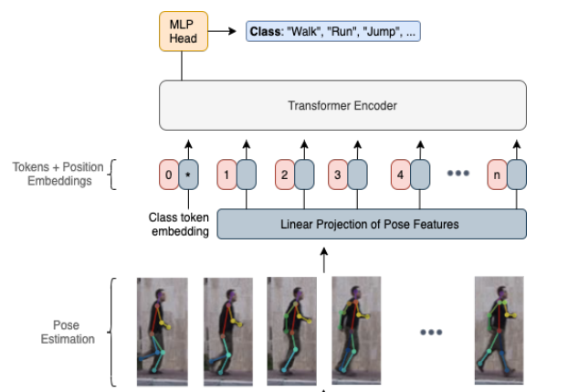
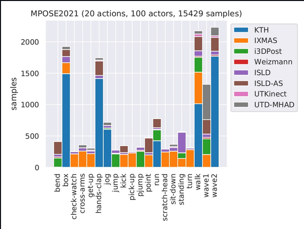

# Action Transformer: A Self-Attention Model for Short-Time Pose-Based Human Action Recognition

> @article{mazzia2022action,
>  title={Action Transformer: A self-attention model for short-time pose-based human action recognition},
>  author={Mazzia, Vittorio and Angarano, Simone and Salvetti, Francesco and Angelini, Federico and Chiaberge, Marcello},
>  journal={Pattern Recognition},
>  volume={124},
>  pages={108487},
>  year={2022},
>  publisher={Elsevier}
> }

### Main Idea

Create a Human Action Recognition by means of attention mechanism combined with autoencoders usin the MPOSE2021 dataset. 

Important aspects covered in this paper are:

* The effectiveness of self attention

* model introspection to study the effects of  the length of the sequence

* A latency studz on different devices

### Important Remarks

* Most previous works use long sequence (high number of frames) to create a dectection, while this works aims to use a shorter sequence such that low latency is achieved

### Pipeline

<div>
    
</div>

### Implementation

* **Linear Projection**
  
  **Inputs**
  
  This is a $X^{in} \in \mathbb{R}^{T\times N \times C}$ tensor, where $T$ is the sequence length,
  
  $N$ is the node number and $C$ is the channel number which is three for posenet models ($x, y, score$).
  
  **Updatable Parameters**
  
  * $W^{l_0} \in \mathbb{R}^{N \cdot C \times D_{model}}$
  
  * $x^{l_0}_{cls} \in \mathbb{R}^{1 \times D_{model}}$ 
  
  * $X_{pos} \in \mathbb{R}^{T \times D_{model}}$
  
  **Equation**
  
  $X^{lp} = [x^{l_0}_{cls};X^{in} \cdot W^{l_0}] + X_{pos}$

* **Transformer ($F_{enc}$)**
  
  Standard encoder as per torch will be used:
  
  * [TransformerEncoderLayer &mdash; PyTorch 1.11.0 documentation](https://pytorch.org/docs/stable/generated/torch.nn.TransformerEncoderLayer.html)[TransformerEncoderLayer &mdash; PyTorch 1.11.0 documentation](https://pytorch.org/docs/stable/generated/torch.nn.TransformerEncoderLayer.html)
  
  * [TransformerEncoder &mdash; PyTorch 1.11.0 documentation](https://pytorch.org/docs/stable/generated/torch.nn.TransformerEncoder.html)
  
  * Using parameters forAcT-$\mu$:
    
    * $H = 1$
    
    * $D_{model}=64$
    
    * $L = 4$
    
    * $n = 1$

* **Multilayer perceptron ($M_{lp}$)**
  
  This layer is a CONV1D
  
  * network size:
    
    * $D{mlp}=256$

* **Output**
  
  $\tilde{y}= M_{lp}(F_{enc}(X^{lp}))$

### Keywords

* BERT:
  
  * Popular language model that uses transformers, bert uses bidirectional transformer
  
  * BERT uses three embeddings to compute the input representations (token embeddings, segment embeddings, and position embeddings)

* Token Embeddings:
  
  - "CLS” is the reserved token to represent the start of sequence while “SEP” separate segment (or sentence)
  - **Token embeddings:** represents a word with a vector
  - **Segment embeddings:** represent the sentence number, for example, if two sentences are present in the input, a word can be assigned to different sentences, so it is a way to identify a sentence.
  - **Position embedding:** Refers to the position of the word inside of the sentence
  
  <div>
      
  </div>

* MPOSE2021
  
  * This is a dataset that contains Openpose and Posenet pose data extracted from popular rgb datasets, the dataset contains 20 actions. The number of frames is between 20 and 30
  
  <div>
      
  </div>
  
  * [GitHub - PIC4SeR/MPOSE2021_Dataset: This repository contains the MPOSE2021 Dataset for short-time pose-based Human Action Recognition (HAR).](https://github.com/PIC4SeR/MPOSE2021_Dataset)

> - ```
>   @article{mazzia2021action,
>     title={Action Transformer: A Self-Attention Model for Short-Time Pose-Based Human Action Recognition},
>     author={Mazzia, Vittorio and Angarano, Simone and Salvetti, Francesco and Angelini, Federico and Chiaberge, Marcello},
>     journal={Pattern Recognition},
>     pages={108487},
>     year={2021},
>     publisher={Elsevier}
>   }
>   ```

* https://towardsdatascience.com/how-bert-leverage-attention-mechanism-and-transformer-to-learn-word-contextual-relations-5bbee1b6dbdbhttps://towardsdatascience.com/how-bert-leverage-attention-mechanism-and-transformer-to-learn-word-contextual-relations-5bbee1b6dbdb

* > @article{devlin2018bert,
  >   title={Bert: Pre-training of deep bidirectional transformers for language understanding},
  >   author={Devlin, Jacob and Chang, Ming-Wei and Lee, Kenton and Toutanova, Kristina},
  >   journal={arXiv preprint arXiv:1810.04805},
  >   year={2018}
  > }
